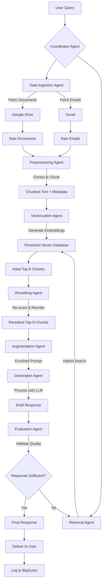
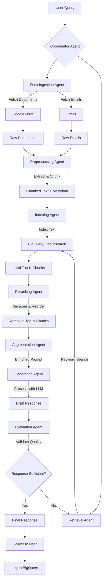

# Design Document: Multi-Agent RAG System for Google Drive and Gmail

## 1. Overview
This document outlines three designs for a Retrieval-Augmented Generation (RAG) system to process enterprise-scale content from Google Drive and Gmail, ensuring high-quality responses.

### Designs
1. **With Persistent VectorDB**: Indexes all content into a persistent VectorDB for semantic search.
2. **Without VectorDB (BigQuery/Elasticsearch)**: Uses keyword-based search in a traditional database.
3. **Dynamic Keyword Search with Temporary VectorDB**: Generates keywords, retrieves top 100/1,000 files/emails, embeds them into a temporary VectorDB.

## 2. Objectives
- Handle multi-GB documents and emails.
- Deliver accurate, context-aware responses.
- Optimize costs for enterprise deployment.
- Ensure scalability and security.
- Minimize latency while maintaining accuracy.

## 3. System Components

### 3.1 Common Agents
1. **Data Ingestion Agent**: Fetches documents/emails via Google Drive/Gmail APIs.
2. **Preprocessing Agent**: Extracts text, chunks content, generates metadata.
3. **Augmentation Agent**: Combines query with chunks into a prompt.
4. **Generation Agent**: Generates responses using Gemini 1.5 Pro.
5. **Evaluation Agent**: Assesses retrieval/response quality.
6. **Coordinator Agent**: Orchestrates workflow, logs interactions.

### 3.2 Design-Specific Agents
**Design 1: Persistent VectorDB**:  

7. **Vectorization Agent**: Embeds chunks into persistent VectorDB. 

8. **Retrieval Agent**: Performs hybrid search.
   
10. **Reranking Agent**: Re-scores chunks. 

**Design 2: BigQuery/Elasticsearch**:
7. **Indexing Agent**: Indexes text in BigQuery/Elasticsearch.

8. **Retrieval Agent**: Performs keyword search.
   
10. **Reranking Agent**: Re-scores chunks (BM25 or MiniLM).

**Design 3: Temporary VectorDB**:
7. **Query Analysis Agent**: Generates surface/semantic/contextual keywords.

8. **Data Ingestion Agent (Modified)**: Retrieves top 100/1,000 files/emails.
   
10. **Vectorization Agent**: Embeds chunks into temporary VectorDB.
    
12. **Retrieval Agent**: Performs semantic search.
    
14. **Reranking Agent**: Re-scores chunks.

## 4. Workflow

### Design 1: Persistent VectorDB

1. **Query received by Coordinator Agent.**
2. **Data Ingestion Agent fetches documents/emails (initially).**
3. **Preprocessing Agent chunks text, generates metadata.**
4. **Vectorization Agent embeds chunks into persistent VectorDB.**
5. **Retrieval Agent performs hybrid search for top-k chunks.**
6. **Reranking Agent re-scores chunks.**
7. **Augmentation Agent creates prompt.**
8. **Generation Agent produces response.**
9. **Evaluation Agent validates quality, loops back if needed.**
10. **Coordinator Agent delivers response, logs to BigQuery.**
    

### Design 2: Without VectorDB (BigQuery/Elasticsearch)

1. **Query received by Coordinator Agent.**
2. **Data Ingestion Agent fetches documents/emails (initially).**
3. **Preprocessing Agent chunks text, generates metadata.**
4. **Indexing Agent stores text/metadata in BigQuery/Elasticsearch.**
5. **Retrieval Agent performs keyword search with metadata filters.**
6. **Reranking Agent re-scores chunks (BM25 or MiniLM).**
7. **Augmentation Agent creates prompt.**
8. **Generation Agent produces response.**
9. **Evaluation Agent validates quality, loops back if needed.**
10. **Coordinator Agent delivers response, logs to BigQuery.**

### Design 3: Dynamic Keyword Search with Temporary VectorDB

1. **Query received by Coordinator Agent.**
2. **Query Analysis Agent generates surface/semantic/contextual keywords.**
3. **Data Ingestion Agent searches Google Drive/Gmail for top 100/1,000 files/emails.**
4. **Preprocessing Agent chunks text, generates metadata.**
5. **Vectorization Agent embeds chunks into temporary VectorDB.**
6. **Retrieval Agent performs semantic/hybrid search for top-k chunks.**
7. **Reranking Agent re-scores chunks.**
8. **Augmentation Agent creates prompt.**
9. **Generation Agent produces response.**
10. **Evaluation Agent validates quality, loops back if needed.**
11. **Coordinator Agent delivers response, logs to BigQuery.**
    
## 5. Logging Strategy
- **Components**: Query logs, agent logs, performance metrics, API usage, security logs.
- **Implementation**: Google Cloud Logging, BigQuery storage, 30-day retention.
- **Cost**: ~$5/month for 250 GB.
- **Design-Specific**: Log VectorDB performance (Design 1), keyword search (Design 2), keyword generation/temporary VectorDB (Design 3).

## 6. Cost Analysis

### Assumptions
- **Dataset**: 10,000 documents (100 chunks each), 50,000 emails (10 chunks each) → 1.5M chunks, 500 tokens/chunk.
- **Query Volume**: 1,000 queries/day.
- **Design 3 Specific**: Top 100 files/emails (10,000 chunks) or 1,000 files/emails (100,000 chunks) per query.

### Pricing (based on Google Cloud/Pinecone estimates)
- Document AI: $0.05/page
- Vertex AI Embeddings: $0.0001/1,000 tokens
- Vertex AI Vector Search: $0.10/GB/month, $0.001/query
- BigQuery: $0.02/GB/month storage, $5/TB scanned
- Elasticsearch: $25/month for small cluster
- Gemini 1.5 Pro: $0.0025/1,000 tokens
- MiniLM Reranking: $0.0005/query
- Redis: $10/month for small instance

---

### Design 1: With Persistent VectorDB

#### Initial Costs
- Preprocessing (Document AI, 10,000 pages): $500
- Embedding (750M tokens): $75
- **Total Initial**: $575

#### Monthly Costs
- Embedding Updates (10% new data): $7.50
- VectorDB Storage (4.6 GB): $0.46
- Queries (1,000/day): $30
- Reranking (MiniLM): $15
- Infrastructure (Storage: $20, LLM: $25): $45
- Logging: $5
- **Total Monthly**: $102.96

**Optimized**: Selective vectorization (50% chunks), caching, serverless VectorDB → ~$45/month

---

### Design 2: Without VectorDB (BigQuery)

#### Initial Costs
- Preprocessing: $500
- Indexing (BigQuery setup): $0
- **Total Initial**: $500

#### Monthly Costs
- Storage (1 TB): $20
- Queries (1 TB scanned): $5
- Reranking (BM25): $0
- Infrastructure (Storage: $20, LLM: $25): $45
- Logging: $5
- **Total Monthly**: $75

**Optimized**: Caching, metadata filtering → ~$60/month

---

### Design 3: Dynamic Keyword Search with Temporary VectorDB

#### Initial Costs
- Preprocessing (cache for frequent files, 10,000 pages): $500
- **Total Initial**: $500

#### Monthly Costs (100 Files)
- Keyword Generation (Gemini Nano, $0.0001/query): $3
- Preprocessing (cached, 10% new data): $50
- Embedding (10,000 chunks/query, 5M tokens, 50% cached): $750
- Temporary VectorDB (Redis): $10
- Queries (1,000/day): $30
- Reranking (MiniLM): $15
- Infrastructure (Storage: $20, LLM: $25): $45
- Logging: $5
- **Total Monthly**: $908

**Optimized**: Caching, 100 files, lightweight keywords → ~$888/month  
**1,000 Files**: ~$8,900/month (10x embedding/VectorDB costs)

---

### Cost Optimization Strategies
- **Design 1**: Selective vectorization, caching, serverless VectorDB
- **Design 2**: Metadata filtering, query caching, use Elasticsearch ($25/month)
- **Design 3**: Cache preprocessed chunks/embeddings, limit to 100 files, use Word2Vec for keywords ($1/month)

## 7. Efficiency Comparison

### Design 1: Persistent VectorDB
- **Latency**: Low (~100–500 ms for VectorDB queries)
- **Accuracy**: High (semantic search captures nuanced queries, e.g., “summarize project report”)
- **Scalability**: Excellent (handles billions of vectors)
- **Throughput**: High (supports high QPS)

### Design 2: BigQuery/Elasticsearch
- **Latency**: Moderate (~200–1,000 ms for keyword search)
- **Accuracy**: Moderate (keyword search misses semantic nuances, e.g., synonyms)
- **Scalability**: Good (scales for text, limited by query complexity)
- **Throughput**: Moderate (slower for complex queries)

### Design 3: Temporary VectorDB
- **Latency**: High (~1–5 seconds due to per-query keyword generation, API search, embedding, and VectorDB creation)
- **Accuracy**: High for subset (semantic search on 100/1,000 files), but limited by keyword-based filtering accuracy
- **Scalability**: Poor (Google Drive/Gmail API rate limits, embedding overhead)
- **Throughput**: Low (bottlenecked by dynamic processing)

---

## 8. Cost-Effectiveness vs. Efficiency Analysis

### Design 1: Persistent VectorDB
- **Cost-Effectiveness**: High (optimized: $45/month). Low initial cost ($575) amortized over time
- **Efficiency**: High (fast, accurate, scalable). Ideal for frequent, complex queries
- **Best For**: Enterprises with large datasets, high query volumes, and accuracy needs (e.g., summarizing complex reports)

### Design 2: BigQuery/Elasticsearch
- **Cost-Effectiveness**: High (optimized: $60/month). No embedding costs, but higher storage ($20/month)
- **Efficiency**: Moderate (faster for simple queries, less accurate for nuanced ones)
- **Best For**: Cost-sensitive scenarios with simpler, keyword-driven queries (e.g., search by sender)

### Design 3: Temporary VectorDB
- **Cost-Effectiveness**: Low (optimized: $888/month for 100 files). High per-query costs outweigh storage savings
- **Efficiency**: Low (high latency, good accuracy for subset). Limited by API and embedding bottlenecks
- **Best For**: Infrequent, targeted queries where 100 files suffice and semantic accuracy is critical

---

### Trade-Offs
- **Cost vs. Efficiency**: 
  - Design 1 offers the best balance (lowest cost, highest efficiency)
  - Design 2 sacrifices accuracy for cost
  - Design 3 achieves high accuracy but at prohibitive costs and latency

### Use Case Fit
- **High Accuracy**: Design 1 or 3 (Design 1 is cheaper)
- **Low Cost**: Design 2
- **Targeted Queries**: Design 3 (with heavy optimization)

## 9. Security and Compliance
- OAuth 2.0, IAM, Google DLP, audit logging.
- Design 3: Securely delete temporary VectorDB data.

## 10. Flowcharts
---
### Design 1: Persistent VectorDB

----
### Design 2: BigQuery/Elasticsearch

----
### Design 3: Temporary VectorDB

----

## 11. Conclusion
- **Design 1**: Best for accuracy and efficiency, cost-effective for frequent queries.
- **Design 2**: Best for cost-sensitive, simpler queries.
- **Design 3**: Suitable for targeted queries with optimization, but high costs limit scalability.
